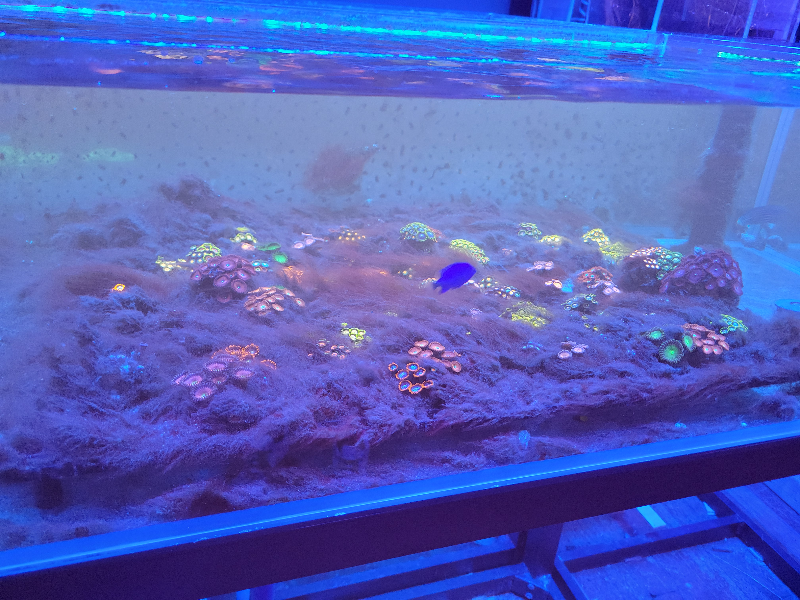
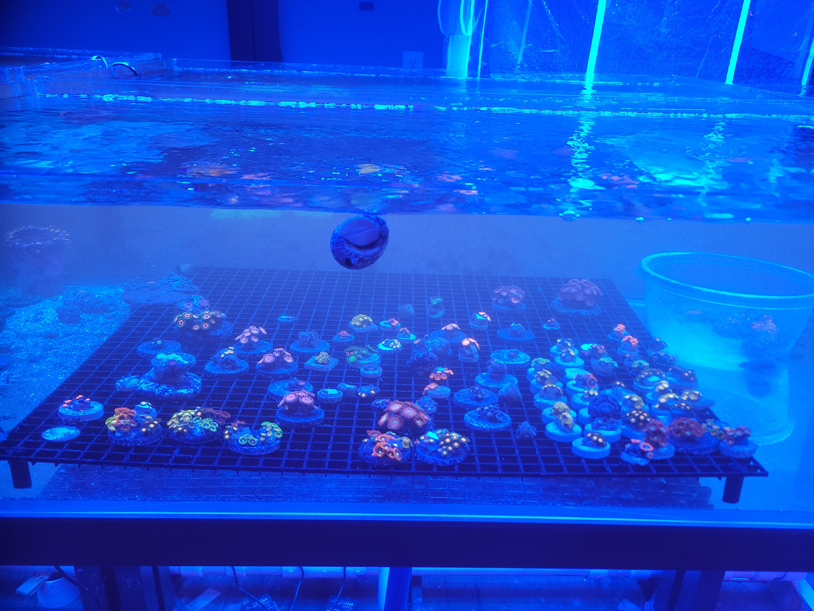

# Next-Generation Phosphate Treatment 
🔗 **Product Documentation**
 [Safety Data Sheet (SDS)](FILE_ExPure_SDS_NanoFe3O4_Al2O3.pdf)
## For Salt and Freshwater Aquariums
Maintaining a healthy saltwater aquarium requires precise control over water chemistry.  
Phosphate levels are critical to this balance, and **ZeroFour** is a cutting-edge solution designed specifically to reduce and stabilize phosphate concentrations efficiently and safely.

---
Incoming Water Quality (Before use of .ZeroFour)  –  [Eurofins Water Report](FILE_ExPure_SDS_NanoFe3O4_Al2O3.pdf)

Ending Water Quality Data (After use of .ZeroFour) – [Eurofins Water Report](FILE_Eurofins end of trial samples.pdf)
---
## Results You Can See

| **Before (0.63 ppm)**   |
|:----------:|
|  |

| **After (0.18 ppm)**   |
|:---------:|
|  |

Example aquarium shown after reduction in phosphate due to treatment with ZeroFour.

---

## How ZeroFour Works

**ZeroFour** works by selectively binding and removing excess phosphates — a major contributor to unwanted algae growth and compromised coral health.

With its advanced formula, ZeroFour helps to:

- Prevent algae blooms  
- Promote clearer water  
- Support vibrant coral coloration  

---

## Easy, Safe, and Effective

Easy to use and fast-acting, **ZeroFour** integrates seamlessly into your regular aquarium maintenance routine without disrupting beneficial biological processes.

Ideal for both **hobbyists** and **professionals**, ZeroFour helps ensure your saltwater environment stays pristine, encouraging thriving marine life and a stunning display.

---

## Why Choose ZeroFour?

Choose **ZeroFour** to protect your investment and enjoy a balanced, beautiful saltwater aquarium with minimal effort.

---

# 📄 GitHub Pages Test

If you can read this page at a URL like:

http://expurewater-stack.github.io

OR via the custom domain:  
http://info.expure.org/

✅ **GitHub Pages is working correctly.**
