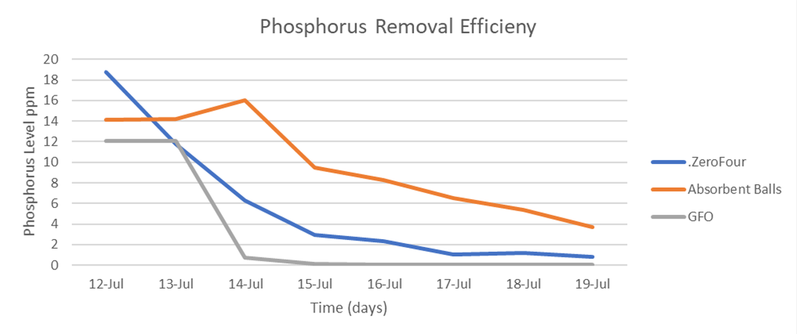
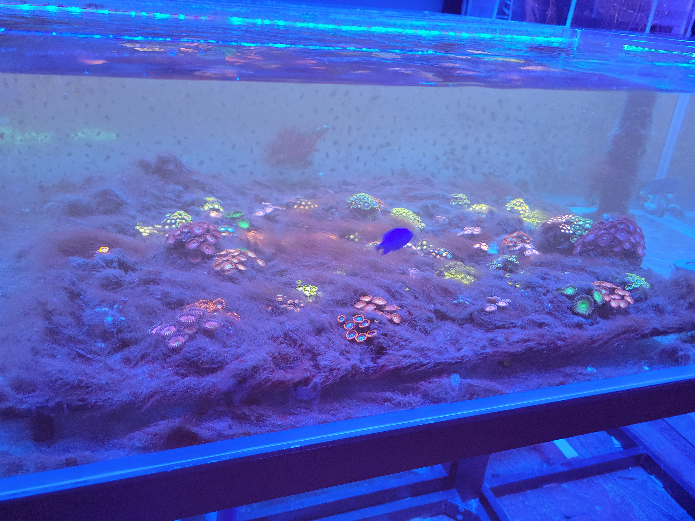
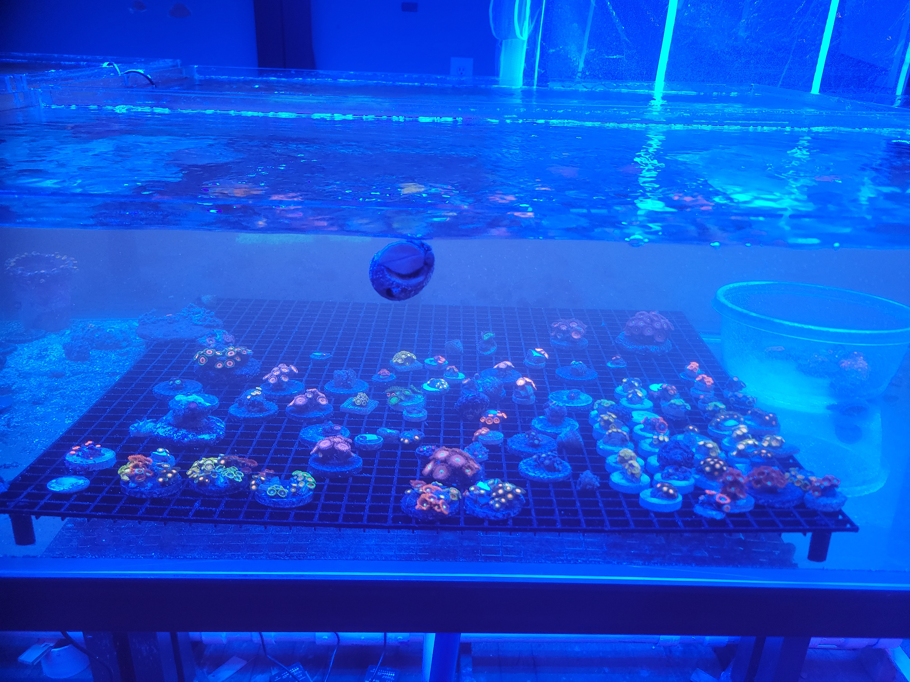

# Next-Generation Phosphate Treatment 
🔗 **Product Documentation**
 [Safety Data Sheet (SDS)](FILE_ExPure_SDS_NanoFe3O4_Al2O3.pdf)
## For Salt and Freshwater Aquariums
Maintaining a healthy saltwater aquarium requires precise control over water chemistry.  
Phosphate levels are critical to this balance, and **ZeroFour** is a cutting-edge solution designed specifically to reduce and stabilize phosphate concentrations efficiently and safely.

**Our Journey**
We are a group of Georgia Tech Researchers trying to migrate our research to provide real world solutions.  Building on a foundation of our work in wastewater treatment.  The research revolved around using magnetic nano-particles to address the challenges surrounding phosphate management.  Recognizing that this was a similar problem for hobbyists we have looked at extending to applications in the aquarium space. As a result we have developed a variant particularly suited to  aquarium environments and the management of phosphates.  We believe it is easier to use and provides a technique to reach and maintain optimum phosphate levels in the aquatic environment. . What you see today is the result of our journey so far leveraging our work to bring a little joy to the world.

| **Product Comparison**   |
|:---------:|
|  |
---
Natura non facit saltus
“Nature does not make leaps” — Carl Linnaeus

Incoming Water Quality (Before use of .ZeroFour)  – [Baseline Eurofins Water Report](FILE_Eurofinsbaselinesamples.pdf)

Ending Water Quality Data (After use of .ZeroFour) – [End of Trial Eurofins Water Report](FILE_Eurofinsendoftrialsamples.pdf)

---
## Results You Can See

| **Before (0.63 ppm)**   |
|:----------:|
|  |

| **After (0.18 ppm)**   |
|:---------:|
|  |

---

## How ZeroFour Works

**ZeroFour** works by selectively binding and removing excess phosphates — a major contributor to unwanted algae growth and compromised coral health.

With its advanced formula, ZeroFour helps to:

- Prevent algae blooms  
- Promote clearer water  
- Support vibrant coral coloration  

---

## Easy, Safe, and Effective

Easy to use and fast-acting, **ZeroFour** integrates seamlessly into your regular aquarium maintenance routine without disrupting beneficial biological processes.

Ideal for both **hobbyists** and **professionals**, ZeroFour helps ensure your saltwater environment stays pristine, encouraging thriving marine life and a stunning display.

---

## Why Choose ZeroFour?

Choose **ZeroFour** to protect your investment and enjoy a balanced, beautiful saltwater aquarium with minimal effort.

✅ **GitHub Pages is working correctly.**
